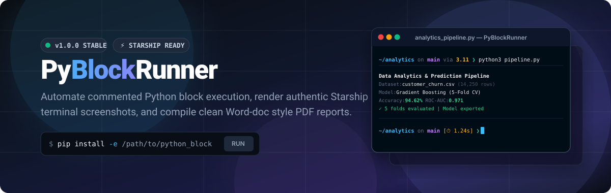
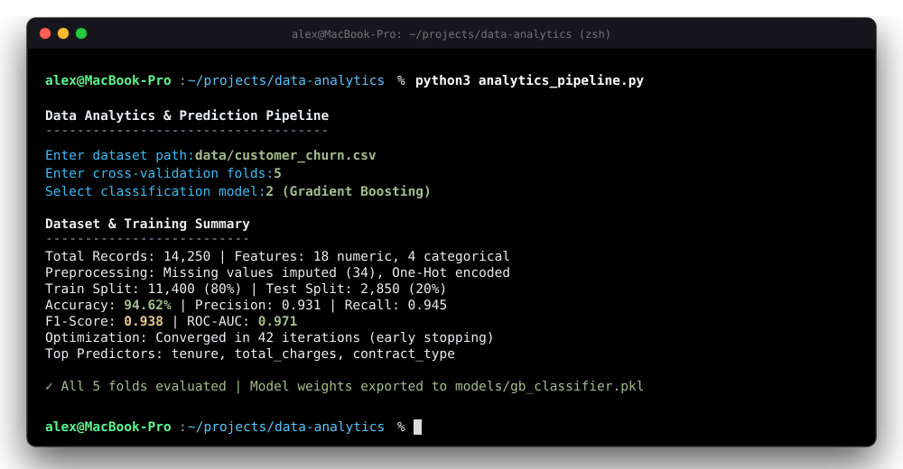
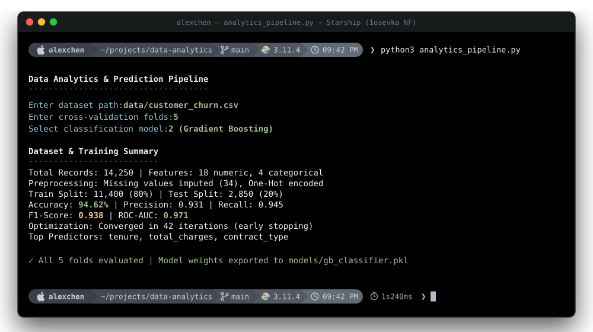
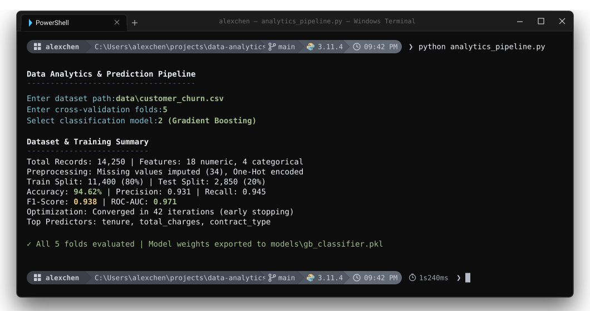
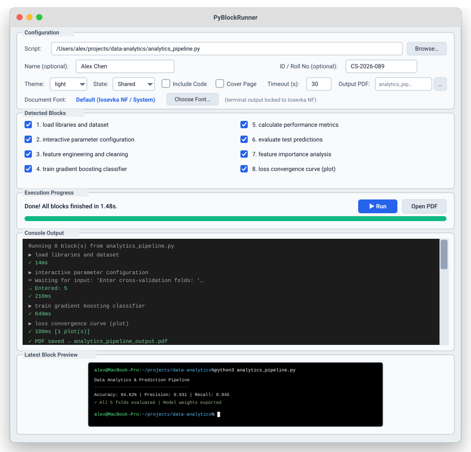
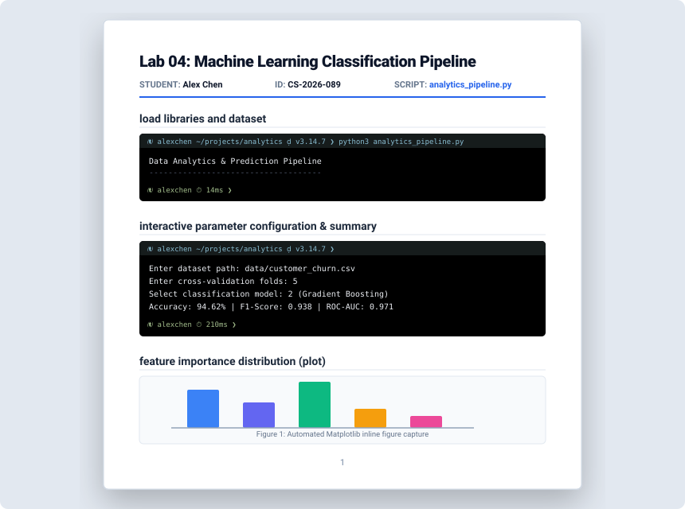
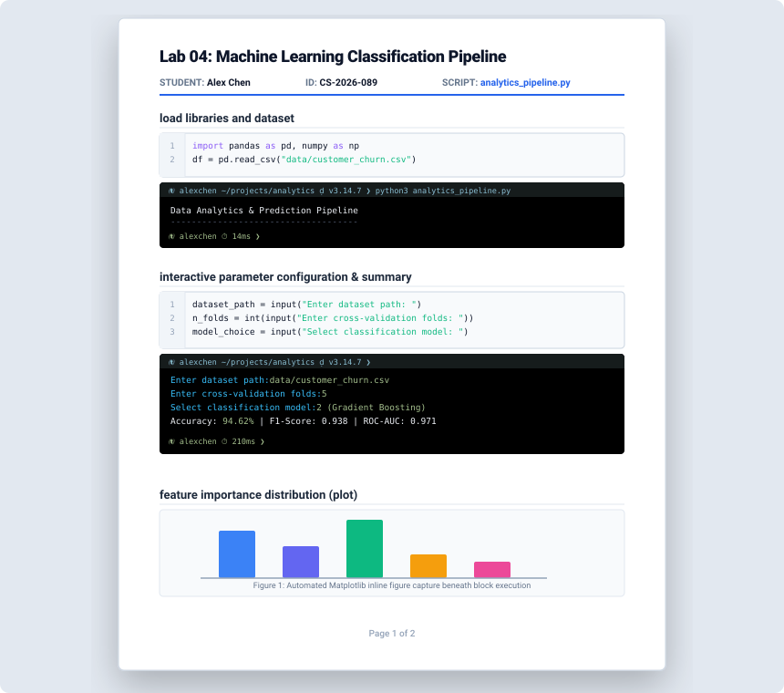
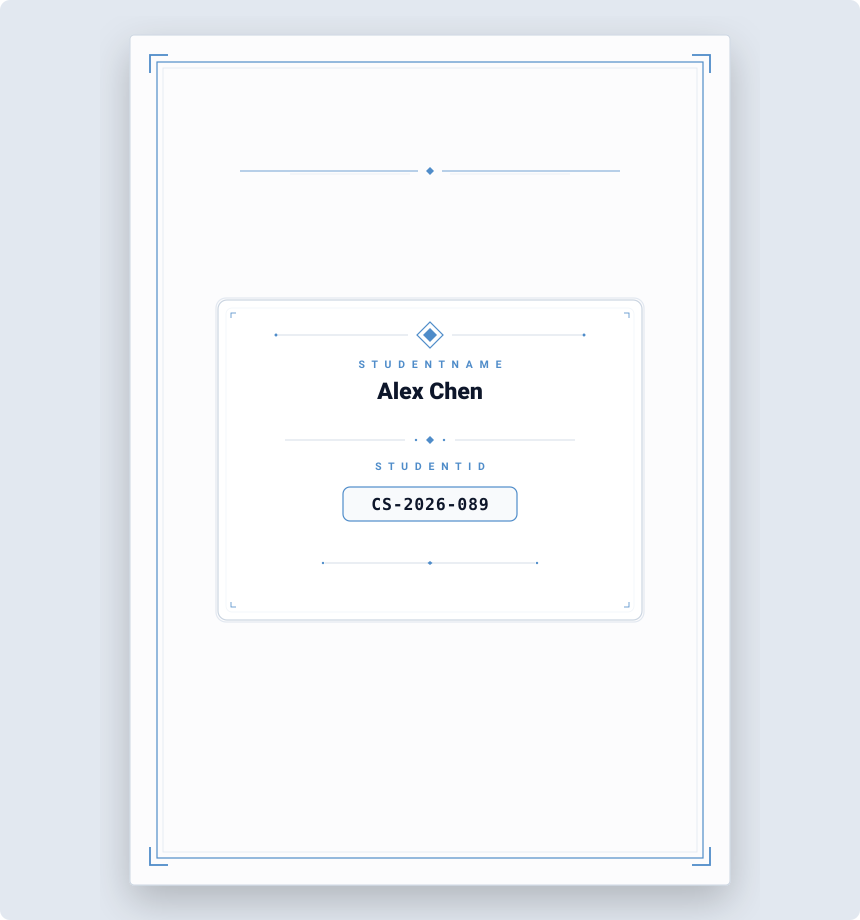
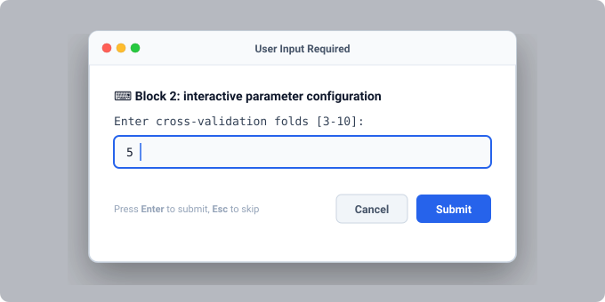

<div align="center">

  

  <p align="center">
    <strong>Automate commented Python block execution, capture authentic Starship terminal outputs, and compile elegant Word-doc style PDF reports.</strong>
  </p>

  <p align="center">
    <a href="#key-features"></a>
    <a href="#license"></a>
    <a href="#visual-showcase"></a>
    <a href="#gui-walkthrough"></a>
    <a href="#zero-bloat-architecture"></a>
  </p>

  <p align="center">
    <a href="#quick-start">Quick Start</a> •
    <a href="#visual-showcase">Visual Showcase</a> •
    <a href="#how-blocks-are-detected">Block Syntax</a> •
    <a href="#gui-walkthrough">GUI Studio</a> •
    <a href="#cli-reference">CLI Reference</a> •
    <a href="#architecture">Architecture</a>
  </p>

</div>

---

## 💡 Why PyBlockRunner?

Writing Python lab assignments, coursework, and problem sets often follows a familiar pattern:
1. Divide a script into `# Problem 1: ...`, `# Task A: ...`, or `# %%` sections.
2. Run each snippet manually in the terminal.
3. Take screenshots of every output, crop them, paste them into Microsoft Word or Google Docs.
4. Manually re-run when code changes or variables depend on earlier sections.

**PyBlockRunner eliminates this repetitive workflow entirely.**

Point PyBlockRunner to any Python script with commented sections. It automatically detects each block, executes them with full state preservation, captures real-time outputs into **authentic terminal screenshot cards (standard prompt or Starship Powerline)**, prompts for interactive `input()`, auto-resolves out-of-scope variables via AST analysis, harvests Matplotlib figures inline, and exports a publication-grade **Word-doc style PDF report** in seconds.

---

## 📸 Visual Showcase

### 1. Default Standard Terminal Output (Out-of-the-Box)
PyBlockRunner works flawlessly out-of-the-box for all users without requiring any external tools or configurations. It captures authentic, high-resolution terminal cards featuring standard Unix/macOS prompts (`alexchen@MacBook-Pro:~/projects/data-analytics % ...`), window controls, interactive input display, and clean monospace typography.

<div align="center">
  
</div>

> [!NOTE]
> Terminal output cards are locked to **`Iosevka NF`** monospace typography, matching crisp, authentic terminal screenshots.

---

### 2. Starship Terminal Output (Dynamically Adapts to Any User Config)
Every developer's `starship.toml` configuration is unique—from the default minimal Starship prompt to Powerline pills, Gruvbox, Tokyo Night, Pure, Pastel, or custom Nerd Font icon arrangements. PyBlockRunner dynamically adapts to your personal setup:

- **🚀 Live CLI Engine (Zero Configuration)**: When the `starship` binary is installed on your system, PyBlockRunner automatically invokes `starship prompt` directly within your active environment. It captures your exact custom modules, symbols, and truecolor ANSI styling with 100% fidelity.
- **🎨 Built-in Smart Fallback**: If Starship is not installed on your system (or running in headless CI environments), PyBlockRunner seamlessly falls back to its built-in Starship engine. It automatically inspects `~/.config/starship.toml` to extract your custom palette, queries your dynamic system username (`getpass.getuser()`), renders native OS glyphs (``, ``, `⊞`), and computes execution duration badges (`⏱ 1s240ms`).

#### macOS Terminal (Dark Glass & Powerline)
<div align="center">
  
</div>

#### Windows 11 Terminal (PowerShell & Starship Powerline)
<div align="center">
  
</div>

---

### 3. Desktop GUI Studio
A responsive desktop application built with Tkinter, featuring 5 stacked panels: Configuration & Metadata, Detected Blocks checklist, Execution Progress, Real-Time Console Output, and Latest Block Preview.

> [!TIP]
> The **Name** and **ID / Roll No** fields are **strictly optional**. Leave them blank for clean personal documentation without author headers, or fill them in for formal course and lab submissions.

<div align="center">
  
</div>

---

### 4. Word-Doc Style PDF Reports
No cluttered page breaks or unnecessary preamble blocks. Sections are packed onto crisp A4 pages with single clean headers, optional author metadata, embedded terminal output cards, and inline Matplotlib charts. PyBlockRunner supports multiple presentation formats depending on your needs:

#### A. Standard Clean Report Page (Terminal Outputs & Charts)
Tight vertical packing on A4 pages. Each detected block renders as an elegant section with its title, an authentic terminal screenshot card, and inline figures.

<div align="center">
  
</div>

#### B. Report with Input Code Snippets (`--code` / "Include Code")
Displays numbered Python syntax boxes directly above each corresponding terminal execution card, providing full visibility into both the executed code and its live output.

<div align="center">
  
</div>

#### C. Formal Submission Cover Page (`--cover` / "Cover Page")
Generates a formal, elegant submission cover page featuring precision architectural framing, geometric corner crosshairs, an ornamental central crest, and a dedicated credential showcase card presenting exclusively the student's Name and ID.

<div align="center">
  
</div>

---

### 5. Interactive User Input Modal
When a script executes `input()`, PyBlockRunner seamlessly pauses the block and renders an interactive desktop prompt dialog. The entered value is recorded and displayed in the terminal output card just like a live terminal session.

<div align="center">
  
</div>

---

## ✨ Key Features

- **⚡ Dynamic Terminal Screenshots (Standard & Adaptive Starship)**: Renders standard clean Unix/macOS/Windows prompts out-of-the-box. When Starship is enabled, it dynamically executes your active `starship prompt` CLI to capture your exact personal `starship.toml` setup (Default, Powerline, Gruvbox, Tokyo Night, Pure, etc.) with truecolor ANSI rendering, or seamlessly falls back to built-in emulation with dynamic username (`getpass.getuser()`), OS glyphs, and execution timers.
- **🖥️ Native Desktop GUI**: Built with Tkinter (zero Electron / webview bloat). Includes block selection checkboxes, live streaming output log, and font selector.
- **⌨️ Interactive `input()` Handling**: Seamless modal dialog prompts for user input during code execution, logging prompts and typed values directly into the output stream.
- **🧠 AST Out-of-Block Dependency Resolution**: If a block references variables or imports declared earlier in the file, PyBlockRunner analyzes the AST, extracts the prerequisite assignments, and injects them automatically.
- **🛡️ Control Flow & Loop Protection**: Indented comments inside `while`, `for`, `if`, `def`, and `class` statements are never severed, preserving loop conditions and flow integrity. Includes a 5 MB buffer ceiling to safeguard against infinite print loops.
- **📊 Matplotlib Figure Harvesting**: Hooks directly into `plt.show()` and inspects active figures, capturing and embedding high-resolution charts inline beneath their corresponding terminal output cards.
- **📄 Word-Doc Style PDF Builder**: Clean single-line section headers, tight vertical packing on A4 pages, optional cover page, and optional code snippets.
- **🎨 Light & Dark Themes**: Supports both light and dark document styles, defaulting to a clean light aesthetic for formal submissions.
- **🪶 Zero Heavy PDF Dependencies**: Powered by Pillow. No headless Chromium, Selenium, Weasyprint, or heavy C libraries required.

---

## 🚀 Quick Start

### Installation

#### Method 1: Direct Install via pip (Recommended)
You can install and run PyBlockRunner directly from GitHub without cloning:

```bash
# Core installation (CLI, GUI Studio, Starship cards, Word-doc style PDF)
pip install git+https://github.com/raian-ruku/python_block_runner.git

# With automated Matplotlib figure harvesting support
pip install "pyblockrunner[plots] @ git+https://github.com/raian-ruku/python_block_runner.git"
```

#### Method 2: Clone for Local Development (Editable Mode)
If you want to view, inspect, or modify the source code locally:

```bash
# 1. Clone the repository
git clone https://github.com/raian-ruku/python_block_runner.git
cd python_block_runner

# 2. Install in editable mode
pip install -e .

# Or install with Matplotlib support
pip install -e ".[plots]"
```

---

### 🔄 Updating to the Latest Version

When new updates are published, update your installation with a single command:

* **For Direct pip Installs**:
  ```bash
  pip install --upgrade --force-reinstall git+https://github.com/raian-ruku/python_block_runner.git
  ```
* **For Local Git Clones**:
  ```bash
  git pull
  ```

---

### Basic Usage

#### 1. Open the Desktop GUI
```bash
# Open GUI with a target script pre-loaded
pyblockrunner my_script.py

# Launch empty GUI studio
pyblockrunner
```

#### 2. Run Headless (CLI Only)
```bash
# Execute blocks and generate PDF directly in terminal
pyblockrunner analytics_pipeline.py --no-gui --open

# Add student metadata for report header & cover
pyblockrunner analytics_pipeline.py --name "Alex Chen" --id "CS-2026-089" --no-gui
```

#### 3. One-Key IDE Integration (VS Code / Cursor)
PyBlockRunner includes `.vscode/tasks.json`. Open any Python file and press:
- **`Cmd + Shift + B`** (macOS)
- **`Ctrl + Shift + B`** (Windows / Linux)

PyBlockRunner will instantly launch on the active file.

---

## 📝 How Blocks Are Detected

PyBlockRunner uses an indentation-aware state machine to parse sections. Any top-level comment matching the following patterns defines a new block:

| Pattern Type | Syntax Example | Generated Title |
|---|---|---|
| **Jupyter Cell** | `# %% Data Cleaning` | `Data Cleaning` |
| **Numbered Problem** | `# Problem 1: Array Manipulation` | `Problem 1: Array Manipulation` |
| **Numbered Task** | `# task 2: validate user input` | `task 2: validate user input` |
| **Question / Exercise** | `# Question 3: Matrix Multiplication` | `Question 3: Matrix Multiplication` |
| **Dashed Header** | `# --- Neural Network Setup ---` | `Neural Network Setup` |
| **Equals Header** | `# === Summary of Results ===` | `Summary of Results` |
| **Markdown Hashes** | `### Evaluation Metrics` | `Evaluation Metrics` |

### Skipping Blocks
To exclude a block from execution and PDF generation, add `pyblock: skip` to its comment:
```python
# %% Problem 4: Scratchpad (pyblock: skip)
# This block will not be executed or included in the PDF report
```

### Control Flow Safety
Comments indented inside loops, functions, or conditionals are strictly preserved as executable code lines:
```python
while retry_training:
    # step 4: adjust learning rate      <-- Preserved inside loop (never severed!)
    learning_rate = float(input("Enter new rate: "))
```

---

## 🖥️ GUI Studio Walkthrough

<div align="center">
  
</div>

| Control | Description | Default |
|---|---|---|
| **Script Picker** | Browse and load your Python source file. Automatically triggers block parsing. | `None` |
| **Name & ID** | **Optional metadata fields** printed in report header and cover page. Can be left completely empty for clean personal reports. | Empty (Optional) |
| **Theme** | Select between `light` (clean document) and `dark` (cyber aesthetic). | `light` |
| **State** | `Shared` (cumulative variables across blocks) or `Isolated` (fresh namespace). | `Shared` |
| **Include Code** | Toggle whether raw Python source code boxes precede terminal screenshots. | `Unchecked` |
| **Cover Page** | Toggle inclusion of a dedicated title / cover page. | `Unchecked` |
| **Timeout (s)** | Maximum seconds per block before non-fatal timeout cancellation. | `30s` |
| **Detected Blocks** | Checkbox list of all discovered blocks. Uncheck any block to skip execution. | All Checked |
| **Font Chooser** | Interactively browse and preview installed system fonts for headings. | `Iosevka NF` |

---

## ⚙️ CLI Reference

```
pyblockrunner [script.py] [options]
```

### Options & Flags

| Flag | Argument | Description | Default |
|---|---|---|---|
| `--gui` | *None* | Force open desktop GUI window. | Default |
| `--no-gui` | *None* | Run headlessly in terminal. | Off |
| `--name` | `NAME` | Author / student name for report (Optional). | `None` |
| `--id` | `ID` | Student / ID / Roll number (Optional). | `None` |
| `--theme` | `light \| dark` | Document and terminal color theme. | `light` |
| `--code` | *None* | Include code snippets in screenshot cards. | Off |
| `--no-code` | *None* | Explicitly omit code snippets. | Default |
| `--cover` | *None* | Include a dedicated cover page. | Off |
| `--no-cover` | *None* | Omit cover page. | Default |
| `--output`, `-o` | `PATH` | Custom path for the output PDF. | `<script>_output.pdf` |
| `--output-dir` | `DIR` | Destination directory for generated PDF. | Script Directory |
| `--isolated` | *None* | Run each block in an isolated namespace. | Shared |
| `--timeout` | `SECONDS` | Timeout ceiling per block (0 = no limit). | `30` |
| `--open` | *None* | Automatically open PDF in default viewer when finished. | Off |
| `--font` | `NAME_OR_PATH` | Monospace font name or TTF/OTF path. | `Iosevka NF` |
| `--separator` | `REGEX` | Custom regex pattern for block detection. | Auto-detect |
| `--version`, `-v` | *None* | Print PyBlockRunner version and exit. | — |

---

## 🏗️ Architecture

PyBlockRunner is organized into decoupled, modular components:

```
python_block_runner/
├── pyproject.toml               # Package metadata & entry points
├── requirements.txt             # Core dependencies
├── README.md                    # Documentation
├── .vscode/
│   └── tasks.json               # IDE build shortcut (Cmd+Shift+B)
├── docs/
│   └── assets/                  # High-resolution vector diagrams & previews
│       ├── hero_banner.svg
│       ├── default_terminal.svg
│       ├── starship_terminal.svg
│       ├── starship_windows.svg
│       ├── gui_preview.svg
│       ├── pdf_preview.svg
│       ├── pdf_code_preview.svg
│       ├── pdf_cover_preview.svg
│       └── input_modal.svg
└── pyblockrunner/
    ├── __init__.py              # Package init (v1.0.0)
    ├── parser.py                # Indentation-aware comment block parser
    ├── executor.py              # Sequential execution engine & input() hook
    ├── resolver.py              # AST dependency back-propagation resolver
    ├── renderer.py              # Pillow card renderer (code, cards, cover)
    ├── starship.py              # Starship powerline prompt emulator
    ├── pdf_builder.py           # Word-doc style PDF page assembly
    ├── gui.py                   # Native Tkinter desktop studio
    └── cli.py                   # Command-line interface & argument parser
```

### Execution Pipeline

```
  ┌────────────────┐
  │ Python Script  │
  └───────┬────────┘
          ▼
  ┌────────────────┐
  │   parser.py    │ ──► Splits code into Block objects (preserves indented loops)
  └───────┬────────┘
          ▼
  ┌────────────────┐
  │  executor.py   │ ◄──► AST Dependency Resolver (injects missing variables)
  │                │ ◄──► Interactive Input Modal (pauses on input())
  │                │ ◄──► Stream Ceiling & Loop Protection (5 MB cap)
  └───────┬────────┘
          ▼
  ┌────────────────┐
  │  starship.py   │ ──► Generates authentic Starship powerline prompt lines
  │  renderer.py   │ ──► Renders pixel-perfect terminal cards (Iosevka NF)
  └───────┬────────┘
          ▼
  ┌────────────────┐
  │ pdf_builder.py │ ──► Packs cards, plots & single headers into Word-style A4 PDF
  └───────┬────────┘
          ▼
  ┌────────────────┐
  │ Output Report  │ (e.g. script_output.pdf)
  └────────────────┘
```

---

## 📦 Requirements

- **Python**: `>= 3.8`
- **Pillow**: `>= 9.0` (Core image synthesis & PDF compilation)
- **Tkinter**: Standard Python built-in library (Desktop GUI)
- **matplotlib** *(Optional)*: Auto-detected for figure capture

---

## 📄 License

Distributed under the **MIT License**. See [`LICENSE`](LICENSE) for details.

---

<div align="center">
  <sub>Built with ❤️ for students, educators, and developers. Starship prompt style inspired by <a href="https://starship.rs">Starship</a>.</sub>
</div>
